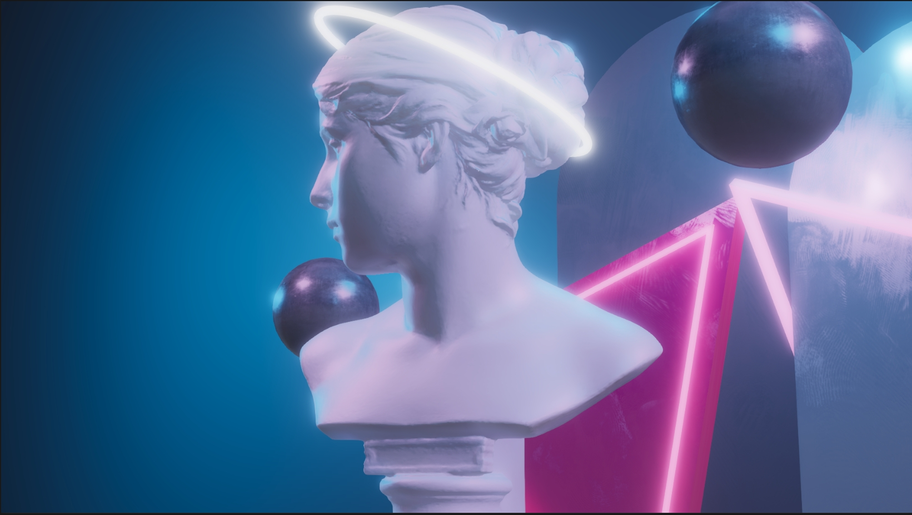
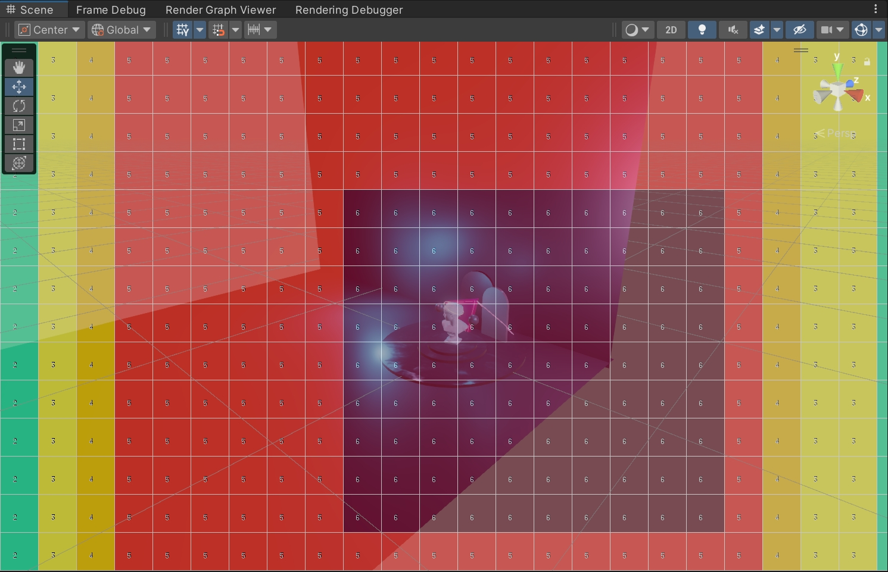

# SRP-Project

This project serves as my hands-on exploration of Unity SRP, featuring an art scene specifically designed to test Physically-Based Rendering materials and baked lighting interactions. All code includes thorough comments with implementation rationale, partially based on [Catlike's SRP Tutorial](https://catlikecoding.com/unity/tutorials/custom-srp/). 

### TODO

- [x] Tiled Based Forward Rendering

- [x] Physically Based Shading

- [ ] Deffered Rendering

- [ ] Render Graph Node Editor

- [ ] Anti Aliasing

  - [x] Render Scale
  - [x] FXAA
  - [ ] MSAA
  - [ ] TAA

- [ ] Ambient Occlusion

  - [ ] SSAO
  - [ ] HBAO
  - [ ] GTAO

- [ ] Post Processing

  - [x] Bloom
  - [x] Tonemapping
  - [x] White Balance
  - [x] Color Adjustments
  - [x] Split Toning
  - [ ] Channel Mixer

  
